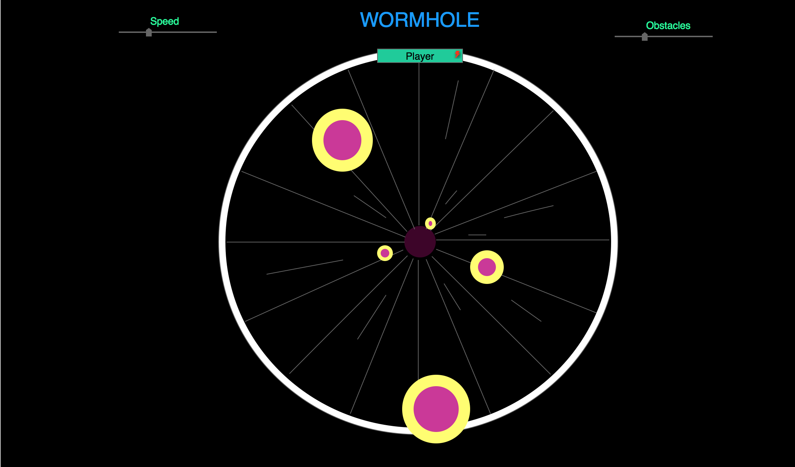

## Overview

Wormhole is a simple and easy game to pick up quickly. The extent of the gameplay is pressing left or right to move the ship the player controls clockwise or counter-clockwise around in a circle while avoiding obstacles coming at them from the center of the screen.

The speed will quickly pick up soon after the game starts with some flashy visuals to draw the player in. I've recognized that simple games with minimal controls, a high level of difficulty, and repetitive gameplay are commonly the easiest to for people to pick up and find hard to put down.

This game is inspired by classic arcade games, particularly   [Tempest](https://en.wikipedia.org/wiki/Tempest_(video_game). I am envisioning a retro design, neon colors, and simple gameplay to reflect the first video games of the early 1980s.

### Functionality

- [ ] Users can press left/right arrow keys to move clockwise/counter-clockwise around the circumference of a circle.
- [ ] Obstacles will be generated at the center of the circle and make their ways to the edge of it at high speeds.
- [ ] The game ends if a player collides with an obstacle.
- [ ] Players can choose to move sliders determining the initial speed and/or spawn rate of the obstacles.
- [ ] The time of each run is recorded and saved to a database. A top 10 list appears at the end of each game.

### Wireframes

The app will consist of a single page with a play button, a scoreboard button, links to the Github repository and developer LinkedIn.

Upon pressing play the game starts and a single line of text being instructions appear on the screen and fade out as the user is given a chance to get accustomed to controlling the avatar.

After a few seconds the first obstacles start to spawn and quickly grow in number as the game continues on.

Upon 'Game Over' a scoreboard modal will slide down listing the player's previous score along with a list of the top ten scores, highlighting their name if they've made it amongst them. A 'Play Again' button will be included on this modal.

##### Technologies employed

* Vanilla JavaScript for game logic.
* HTML5 Canvas for rendering.
* Howler.js (or HTML audio player) for game background music.
* Webpack to bundle various scripts into a single source.
* React.js for basic page structure and functionality.

##### Main files
* `app.jsx` main structure of the page.
* `board.js` will be the center of the game logic.
* `player.js` receives input and outputs reaction and position.
* `obstacle.js` handles individual obstacles throughout their life-span.
* `scorebaord.jsx` fetches scores and displays them in a `<ul></ul>`.

### MVPs

- [ ] Basic visuals and an interactive interface.
- [ ] Player can move avatar around the circle.
- [ ] Obstacles generate and move outward toward the edge of the circle.
- [ ] Obstacles cause 'Game Over' upon collision.
- [ ] Window styling scoreboard modal.
- [ ] Scoreboard data is stored.

### Development timeline

##### Weekend:
- [x] Finish brainstorming, concept, and proposal.
- [x] Finish basic project skeleton and essentials.

##### Day 1:
- [ ] Briefly review games using canvas from the instructional curriculum.
- [ ] Complete basic page skeleton and functionality.
- [ ] Complete board design and rendering.

##### Day 2:
- [ ] Complete player avatar rendering and functionality.
- [ ] Start obstacle rendering and functionality.
- [ ] Ideally finish obstacle rendering and functionality.

##### Day 3:
- [ ] Implement obstacle/player collision.
- [ ] Finish game over condition.
- [ ] Scoreboard rendering.

##### Day 4:
- [ ] Add flair and flashy visuals.
- [ ] Finish styling page.
- [ ] Complete MVPs and iron out project.

##### Day 5:
- [ ] Implement bonus features.

### Bonus features
* Items that may help or hinder the player:
  * Shield protecting from a single collision.
  * Temporary x2 speed for player avatar.
  * Temporary control reverse.
  * Temporary laser turret that destroys obstacles.
* Hostile entity. Moves toward player and causes game over upon collision.
